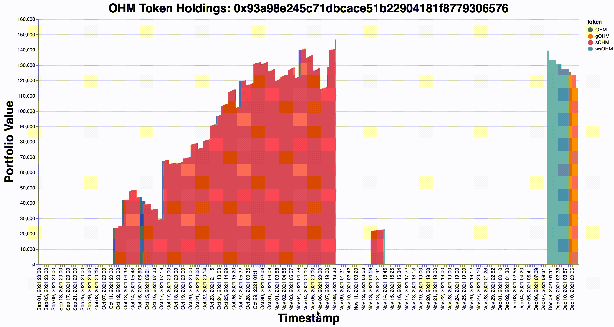

# OHM Portfolio Value 

## Goal 

The goal of this project is to provide holders of the OHM token and its derivatives a convenient way to see how their investment has performed over time. This will be accomplished by producing a visualization of OHM token portfolio value and cumulative amount invested (cost basis) over time. 

Currently, there is no widely available tool that allows users to do this. This is a complex task as the OHM ecosystem has changed a lot since inception: 
- New token types have been introduced (and old ones deprecated)
- Updates to underlying infrastructure (contracts that perform staking / bonding logic)
- Migrations

This is a work in progress. My current focus is on getting an accurate visualization of portfolio value over time and after I have completed this, I'm going to work on integrating information about investment cost basis.

## Methodology

This app tracks OHM, gOHM, sOHM, wsOHM balances. Whenever I say "OHM tokens" I am referencing these 4 tokens. 

1. Get all internal transactions (transactions that happen within smart contracts that are not stored on chain) initiated by the OHM staking distributor contract that invoke the `logRebase` or `logSupply` functions of the `sOHM Token Contract`. This provides us with the epoch, index, and rebase reward for all epochs.
    - This information is not available with free API's, so I did some lightweight scraping of the etherscan website to attain relevant transaction hashes. This is technically against their TOS, but the number of HTTP requests to get the data was quite small, and I made sure to cache the data in a postgresql database. I'm looking for a different way to get this information moving forward.
    - I had to lookup transaction receipts for the transactions scraped from etherscan, then I used an infura hosted ETH node to parse these receipts and extract the function call / return data. 

2. Get all erc20 token transfer events for a given ETH address. 
   - This information is attained via the etherscan free API. 

3. Compute token balances of OHM tokens over time.
   -  For OHM, gOHM, wsOHM, the balance can be determined simply by using transfer events. 
   - For sOHM, I combine rebase events with erc20 transfer events. Transfer events are additive (sOHM added or removed from wallet) while rebases are multiplicative (amount of sOHM updated by multiplying by some reward rate). 

4. Get price history for OHM tokens. 
    - This information is attained bia the coingecko API. 

5. Compute time aligned product of price and holding amount for OHM tokens. 

6. Visualize total portfolio value (denominated in USD) over time for OHM tokens. 

## Future Work

* Multiple User addresses (if you keep your ohm in multiple wallets) 
* Factoring in costs to acquire OHM tokens
  * Recognizing when money is spent to acquire OHM vs other OHM operations (ex: wrapping sOHM to wsOHM should only cost the gas required for the transaction). 
* Handling gaps in data related to migrations 
  * Current data stream for rebase rewards / index / epoch needs to be updated for the v2 migration (which started mid december 2021). 
* Better price data 
  * Coingecko can be unreliable at times, also it is missing lots of sOHM price history (currently just using OHM as a proxy for this). 

